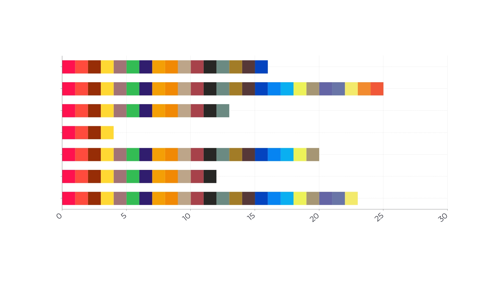

Gravity sort
======


Introdução
---------

Quando queremos encontrar algo, normalmente começamos a procurar nos arredeores e ir expandindo o raio de busca a partir do primeiro local em que a busca foi iniciada. Um perfeito exemplo disso é quando queremos encontrar nosso celular: começamos a buscar nos bolsos de nossas roupas e vamos expandindo a área de busca, procurando na bolsa ou na mochila, depois no cômodo em que estamos, em seguida em outros cômodos próximos a esse e continuaremos a procurar nos cômodos mais distantes até finalmente encontrar o que buscamos.

Mas e se você tivesse um móvel onde todos que entram na sua cada podem deixem seus celuares (de preferência algum com uma tomada por perto ou quem sabe uma base de carregamento), não seria mais simples de procurar e consumiria menos tempo até encontrar o seu celular?

Agora imagine que você queira ligar pra alguém através do seu celular e, que já aderiu a ideia do parágrafo anterior, logo tudo o que precisa fazer é ir até o móvel e pegar seu celular. Ao tê-lo em mãos, você o desbloqueia e acessa sua agenda de contatos, mas percebe que seus contatos não estão em ordem forçando você a olhar um por um até encontrar o contato desejado.

Fica claro que organização, e principalmente ordenação, são de vital importância para as atividades mais rotineiras e simples que executamos. Entretanto em um mundo onde sistemas e serviços digitais são cada vez mais frequentes, a ordenação vai muito além de encontrar um contato rapidamente. Onde gigantescos bancos de dados armazenam desde endereços até dados de pacientes hospitalizados, ordenar adequeada e eficientemente eses diversos tipos de dados significa muito mais do que economizar tempo, também significa evitar o trânsito desviando de uma via congestionada e evitar óbitos garantindo que um paciente em estado grave chegue a tempo no hospital para ser tratado.

E embora cruciais e indispensáveis, aqueles que mantém essa gigantesca infraestrutura digital que permeia praticamente todas as nossas atividades, os algoritmos de ordenação, são, por vezes, surpreendentemente simples.

Introdução
---------

Pensando novamente na lista telefônica, considere o seguinte: você possui 7 contatos na sua agenda (sim, você é bem seletivo com relação ao salvar o número de outras pessoas) e que cada um deles começam com uma letra diferente. A conclusão mais óbvia seria "*pensar na ordem alfabética e colocá-los em ordem*", certo? Mas e se, ao invés de letras, pensarmos em letras que tal em números? 

???Exercício

Considerando que os contatos mencionados a lista de contatos abaixo, qual seria o vetor numérico correspondente?

`[Peach, Yoshi, Mario, Daisy, Toad, Luigi, Wario]`

::: Gabarito

Provavelmente você utilizou a posição das iniciais no alfabeto para realizar a conversão, certo?


Dessa forma a conversão da lista de contatos para um vetor numérico pode ser feita de seguinte forma:

| Contatos | Inicial do Nome | Número |
| -------- | --------------- | ------ |
| Peach    | P (16ª letra)   | 16     |
| Yoshi    | Y (25ª letra)   | 25     |
| Mario    | M (13ª letra)   | 13     |
| Daisy    | D (4ª letra)    | 4      |
| Toad     | T (20ª letra)   | 20     |
| Luigi    | L (12ª letra)   | 12     |
| Wario    | W (23ª letra)   | 23     |

Logo, a lista de contatos se torna o seguinte vetor numérico: `[16, 25, 13, 4, 20, 12, 23]`.

:::

???

Um Novo Ponto de Vista
---------

Ao invés de pensar no vetor de contatos simplesmente como uma lista de valores, considere uma representação visual do mesmo. Uma forma consideravelmente simples seria transformá-lo em um gráfico de barras onde cada valor é representado pela altura de cada uma das barras.

???Exercício

Considerando o vetor de valores obtido anteriormente como  o gráfico abaixo, responda:


Em termos visuais, de que forma poderíamos ordenar os valores do vetor numérico?

::: Gabarito
Poderíamos ordenar os valores mudando as barras de posição, asté se obtivesse a seguinte representação:


:::

???

Se pararmos para pensar, **todos** os algoritmos estudados até agora realizam esse tipo de operação. De uma forma ou de outra, as barras são trocadas de lugar umas com as outras até se obter uma sequência ordenada.


???Exercício

Considerando o vetor de valores obtido anteriormente como  o gráfico abaixo, responda:


Em termos visuais, de que forma poderíamos ordenar os valores do vetor numérico?

::: Gabarito

Poderíamos ordenar os valores mudando os fragmentos de posição, asté se obtivesse a seguinte representação:


:::

???

Se pararmos para pensar, **nenhum** dos algoritmos estudados até agora realizam esse tipo de operação. Definitivamente não é a forma mais intuitiva de se abordar um problema de ordenação, mas não se pode negar sua efetividade já que o vetor resultante está correto.

???Checkpoint

Considernado a segunda forma de ordenação, qual a relação entre a quantidade de fragmentos de uma mesma cor, antes e depois da ordenação ter sido realizada? É necessário mudar todos os fragmentos de lugar?

:::Gabarito
A quantidade de fragmentos de uma mesma cor se preserva ao longo da operação. Além disso, nem todos os fragmentos precisam ser movidos (basta reparar nas 3 primeiras cores de fragmentos ou ainda a última barra na qual o único fragmento modificado é o do topo).
:::

???

Portanto, fica claro que, uma forma possível, ainda que menos usual, de se organizar um vetor numérico é tornando cada valor como uma pilha de fragmentos. Entretanto para que esse método funcione é necessário que cada um dos fragmentos de qualquer uma das pilhas possuam a mesma "altura", ou seja, que a divisão da barra em pilhas seja tal que não sobre fragmentos de tamanhos diferentes na mesma linha.

Isso significa que necessitamos do MDC (múltiplo divisor comum) dos valores encontrados nessa lista, obtendo os múltiplos de cada um dos valores e posteriormente obter o MDC deles. Entretanto cada novo valor inserido nessa lista potencialmente poderia alterar o MDC atual o que faria com que um algoritmo espec;ifico acessasse todos os valores até calcular o novo MDC, fazendo com que haja um consumo de tempo e recursos desnecessário.

Felizmente, exite um MDC global, ou seja, um número que é diivsor de todos os demais e, portanto, não só independe de quais e quantos números presentes no vetor como também dispensa refazer a busca por um novo MDC. 

???Reflexão

Se ainda não veio nada à sua mente, basta pensar na definição básica de números primos, o que ela diz?  

::: Gabarito


:::

???

Logo, basta construir uma pilha de fragmentos de tamanho `1` para cada um dos valores da lista de contatos, o que se resume a criar um vetor do tamanho de cada valor da lista e preenchê-los com `1`.

!!! Aviso
Para facilitar a visualização dos *arrays* use a função fornecida abaixo:

````c
void display_array(int *input, int n) {
    for(int i = 0; i < n; i++) {
        printf("%i ", input[i]);
    }
}
````

!!!


???Exercício

Crie uma função que receba um vetor de inteiros e, para cada um dos valores presentes neste, exiba no terminal um vetor preenchido com `1`.

::: Gabarito

````C
void unit_stack(int *input, int n) {
    int val;
    for(int i = 0; i < n; i++) {
        val = input[i];
        int stack[val];
        for (int j = 0; j < val; j++) {
            stack[j] = 1;
        }
        display_array(stack, val);
        printf("\n");
    }
}
````

:::

???

Nada impossível por enquanto, certo? Você provavelmente obteve o seguinte *output*:

````c
1 1 1 1 1 1 1 1 1 1 1 1 1 1 1 1
1 1 1 1 1 1 1 1 1 1 1 1 1 1 1 1 1 1 1 1 1 1 1 1 1 
1 1 1 1 1 1 1 1 1 1 1 1 1 
1 1 1 1
1 1 1 1 1 1 1 1 1 1 1 1 1 1 1 1 1 1 1 1 
1 1 1 1 1 1 1 1 1 1 1 1
1 1 1 1 1 1 1 1 1 1 1 1 1 1 1 1 1 1 1 1 1 1 1
````

Mas parando pra pensar, é um pouco inconveniente ter que iniciar um vetor dentro de uma função pois ela se torna limitada ao escopo da mesma, impossibilitando realizar quaisquer outras operações posteriores. Seria muito mais interessante se esses vetores estivessem dentro de um outro o qual pudéssemos inicializar fora da função e apenas passá-lo como argumento. Ora, mas isso existe! Um vetor de vetores nada mais  é do que uma **matriz**!

Do Vetor à Matriz
---------

Primeiramente, uma matriz possui tamanho definido. isso significa que devemos inicializá-la sabendo a quantidade de linhas e colunas necessárias. Claro que poderíamos fazer isso utilizando algum valor máximo definido globalmente (algo como `MAX_ROW` e `MAX_COL`), mas lembre-se que memória é um recurso valioso e limitado, então devemos usar somente o necessário.

Podemos novamente criar uma representação visual, desta vez do *output* obtido no exercício anterior. Ao invés de uma lista de `1` pense como sequências de contas ⚫ enfileiradas, como ilustra a imagem a abaixo:


| `n`  | *output*                  |
| ---- | ------------------------- |
| 16   | ⚫⚫⚫⚫⚫⚫⚫⚫⚫⚫⚫⚫⚫⚫⚫⚫          |
| 25   | ⚫⚫⚫⚫⚫⚫⚫⚫⚫⚫⚫⚫⚫⚫⚫⚫⚫⚫⚫⚫⚫⚫⚫⚫⚫ |
| 13   | ⚫⚫⚫⚫⚫⚫⚫⚫⚫⚫⚫⚫⚫             |
| 4    | ⚫⚫⚫⚫                      |
| 20   | ⚫⚫⚫⚫⚫⚫⚫⚫⚫⚫⚫⚫⚫⚫⚫⚫⚫⚫⚫⚫      |
| 12   | ⚫⚫⚫⚫⚫⚫⚫⚫⚫⚫⚫⚫              |
| 23   | ⚫⚫⚫⚫⚫⚫⚫⚫⚫⚫⚫⚫⚫⚫⚫⚫⚫⚫⚫⚫⚫⚫⚫   |

Agora imagine a mesma disposição, mas desta vez preenchendo uma grade quadriculada, onde cada conta ocupa um dos espaços da grade:

| `n`  | 1    | 2    | 3    | 4    | 5    | 6    | 7    | 8    | 9    | 10   | 11   | 12   | 13   | 14   | 15   | 16   | 17   | 18   | 19   | 20   | 21   | 22   | 23   | 24   | 25   |
| ---- | ---- | ---- | ---- | ---- | ---- | ---- | ---- | ---- | ---- | ---- | ---- | ---- | ---- | ---- | ---- | ---- | ---- | ---- | ---- | ---- | ---- | ---- | ---- | ---- | ---- |
| 16   | ⚫    | ⚫    | ⚫    | ⚫    | ⚫    | ⚫    | ⚫    | ⚫    | ⚫    | ⚫    | ⚫    | ⚫    | ⚫    | ⚫    | ⚫    | ⚫    |      |      |      |      |      |      |      |      |      |
| 25   | ⚫    | ⚫    | ⚫    | ⚫    | ⚫    | ⚫    | ⚫    | ⚫    | ⚫    | ⚫    | ⚫    | ⚫    | ⚫    | ⚫    | ⚫    | ⚫    | ⚫    | ⚫    | ⚫    | ⚫    | ⚫    | ⚫    | ⚫    | ⚫    | ⚫    |
| 13   | ⚫    | ⚫    | ⚫    | ⚫    | ⚫    | ⚫    | ⚫    | ⚫    | ⚫    | ⚫    | ⚫    | ⚫    | ⚫    |      |      |      |      |      |      |      |      |      |      |      |      |
| 4    | ⚫    | ⚫    | ⚫    | ⚫    |      |      |      |      |      |      |      |      |      |      |      |      |      |      |      |      |      |      |      |      |      |
| 20   | ⚫    | ⚫    | ⚫    | ⚫    | ⚫    | ⚫    | ⚫    | ⚫    | ⚫    | ⚫    | ⚫    | ⚫    | ⚫    | ⚫    | ⚫    | ⚫    | ⚫    | ⚫    | ⚫    | ⚫    |      |      |      |      |      |
| 12   | ⚫    | ⚫    | ⚫    | ⚫    | ⚫    | ⚫    | ⚫    | ⚫    | ⚫    | ⚫    | ⚫    | ⚫    |      |      |      |      |      |      |      |      |      |      |      |      |      |
| 23   | ⚫    | ⚫    | ⚫    | ⚫    | ⚫    | ⚫    | ⚫    | ⚫    | ⚫    | ⚫    | ⚫    | ⚫    | ⚫    | ⚫    | ⚫    | ⚫    | ⚫    | ⚫    | ⚫    | ⚫    | ⚫    | ⚫    | ⚫    |      |      |


Fica claro, portanto, que a quantidade de **linhas** `r` tem relação direta com a quantidade de valores do vetor de contatos, uma vez que cada linha. Já a quantidade de **colunas** `c` tem relação direta com o maior valor do vetor inicial. 

???Exercício

implemente duas funções `matrix_r` e `matrix_c` que recebam um vetor de inteiros `v` e seu tamanho `n` e retornem os valores de `r` e `c`, respectivamente:

::: Gabarito

```c
int matrix_r(int *input, int n){
	int c = 0;
	for (int i = 0; i < n; i++) {
        c ++;
    }
	return n;
}
```

Note que em um contexto geral, a função `matrix_r` resume-se a uma função `len`.

```c
int matrix_c(int *input, int n) {
	int f = 0;
	for (int i = 0; i < n; i++) {
        if (input[i] > f) {
            f = input[i];
		}
    }
	return f;
}
```

Note que em um contexto geral, a função `matrix_c` resume-se a uma função `max`.

:::

???

Com ambos os valores disponíveis podemos por fim, já é possível inicializar uma matriz do tamanho necessário para comportar as pilhas:

```c
int r = matirx_r(input, n);
int c = matrix_c(input, n);
int m[r][c];
```

O passo seguinte é preencher a de maneira similar ao que fizemos ao preencher a 

Entretanto, atente-se ao fato que apenas preencher a matriz com `1`  não é suficiente, pois é possível que haja lixo de memória em elementos não preenchidos. Uma solução simples é inserir um novo valor de forma que este represente os "espaços vazios". Dessa forma iremos inicializar toda a região de memória alocada para a matriz, garantindo que nenhum lixo de memória seja perpetuado.

Voltando a representação visual, podemos compreender um espaço vazio como a ausência de uma conta ◯, dessa forma teríamos:

| `n`  | 1    | 2    | 3    | 4    | 5    | 6    | 7    | 8    | 9    | 10   | 11   | 12   | 13   | 14   | 15   | 16   | 17   | 18   | 19   | 20   | 21   | 22   | 23   | 24   | 25   |
| ---- | ---- | ---- | ---- | ---- | ---- | ---- | ---- | ---- | ---- | ---- | ---- | ---- | ---- | ---- | ---- | ---- | ---- | ---- | ---- | ---- | ---- | ---- | ---- | ---- | ---- |
| 16   | ⚫    | ⚫    | ⚫    | ⚫    | ⚫    | ⚫    | ⚫    | ⚫    | ⚫    | ⚫    | ⚫    | ⚫    | ⚫    | ⚫    | ⚫    | ⚫    | ◯    | ◯    | ◯    | ◯    | ◯    | ◯    | ◯    | ◯    | ◯    |
| 25   | ⚫    | ⚫    | ⚫    | ⚫    | ⚫    | ⚫    | ⚫    | ⚫    | ⚫    | ⚫    | ⚫    | ⚫    | ⚫    | ⚫    | ⚫    | ⚫    | ⚫    | ⚫    | ⚫    | ⚫    | ⚫    | ⚫    | ⚫    | ⚫    | ⚫    |
| 13   | ⚫    | ⚫    | ⚫    | ⚫    | ⚫    | ⚫    | ⚫    | ⚫    | ⚫    | ⚫    | ⚫    | ⚫    | ⚫    | ◯    | ◯    | ◯    | ◯    | ◯    | ◯    | ◯    | ◯    | ◯    | ◯    | ◯    | ◯    |
| 4    | ⚫    | ⚫    | ⚫    | ⚫    | ◯    | ◯    | ◯    | ◯    | ◯    | ◯    | ◯    | ◯    | ◯    | ◯    | ◯    | ◯    | ◯    | ◯    | ◯    | ◯    | ◯    | ◯    | ◯    | ◯    | ◯    |
| 20   | ⚫    | ⚫    | ⚫    | ⚫    | ⚫    | ⚫    | ⚫    | ⚫    | ⚫    | ⚫    | ⚫    | ⚫    | ⚫    | ⚫    | ⚫    | ⚫    | ⚫    | ⚫    | ⚫    | ⚫    | ◯    | ◯    | ◯    | ◯    | ◯    |
| 12   | ⚫    | ⚫    | ⚫    | ⚫    | ⚫    | ⚫    | ⚫    | ⚫    | ⚫    | ⚫    | ⚫    | ⚫    | ◯    | ◯    | ◯    | ◯    | ◯    | ◯    | ◯    | ◯    | ◯    | ◯    | ◯    | ◯    | ◯    |
| 23   | ⚫    | ⚫    | ⚫    | ⚫    | ⚫    | ⚫    | ⚫    | ⚫    | ⚫    | ⚫    | ⚫    | ⚫    | ⚫    | ⚫    | ⚫    | ⚫    | ⚫    | ⚫    | ⚫    | ⚫    | ⚫    | ⚫    | ⚫    | ◯    | ◯    |

Quanto ao valor que se refere à ◯, já que estamos utilizando `1` para locais ocupados, que tal `0` para os não ocupados? 

???Exercício

implemente a função abaixo com base na função `unit_stack` anteriormente implementada, de forma a atribuir corretamente `1`s e `0`s

````c
void initialize_matrix(int r, int c, int abacus[r][c], int *input) {
}
````

Obs.: Note que o tamanho `n` do vetor de entrada não é passado como parâmetro, por que isso ocorre?

!!! Dica

Para facilitar a visualização da matriz, utilize a função a abaixo:

```c
void display_matrix(int r, int c, int matrix[r][c]) {
    for (int i = 0; i < r; i++) {
        for (int j = 0; j < c; j++) {
            printf("%i ", matrix[i][j]);
        }
        printf("\n");
    }
}
```

!!!

:::Gabarito
O tamanho `n` do vetor entrada não é passado pois `c`**=**`n`, logo o acesso aos elementos podem ser feitos ao longo da iteração do intervalo `[0:c]`. Com isso, tem-se que:

````c
void initialize_matrix(int r, int c, int matrix[r][c], int *input) {
	int val;
	for (int i = 0; i < r; i++) {
        val = input[i];
        for (int j = 0; j < c; j++) {
            if( j < val) {
                matrix[i][j] = 1;
            } else {
                matrix[i][j] = 0;
            }
        }
    }
}
````

:::

???

Após implementar corretamente a função `initialize_matrix`, você provavelmente obteve o seguinte *output*:

````c
1 1 1 1 1 1 1 1 1 1 1 1 1 1 1 1 0 0 0 0 0 0 0 0 0 
1 1 1 1 1 1 1 1 1 1 1 1 1 1 1 1 1 1 1 1 1 1 1 1 1 
1 1 1 1 1 1 1 1 1 1 1 1 1 0 0 0 0 0 0 0 0 0 0 0 0 
1 1 1 1 0 0 0 0 0 0 0 0 0 0 0 0 0 0 0 0 0 0 0 0 0 
1 1 1 1 1 1 1 1 1 1 1 1 1 1 1 1 1 1 1 1 0 0 0 0 0 
1 1 1 1 1 1 1 1 1 1 1 1 0 0 0 0 0 0 0 0 0 0 0 0 0 
1 1 1 1 1 1 1 1 1 1 1 1 1 1 1 1 1 1 1 1 1 1 1 0 0 
````

Da Antiguidade à Modernidade 
---------

Devemos tudo o que sabemos e conhecemos àqueles que vieram antes de nós. Se há uma habilidade que a humanidade merece reconhecimento é pela sua capacidade de transmitir informação, o que resulta em um maior conhecimento acumulado ao passar dos milhares de anos que nossa espécie já viveu. Isso faz com que uma pequena descoberta se torne o gatilho para um feito grandioso capaz de mudar o rumo das futuras gerações.

Isso sempre ocorreu e continua ocorrendo. Desde a antiguidade, enquanto Platão ainda olhava para vultos na parede de uma caverna e Pitágoras ainda media sombras de pirâmides mal sabiam eles que teriam filhos com nomes tão distintos para a época e tão importantes para as demais épocas.

|       Platão        |       Pitágoras        |
| :-----------------: | :--------------------: |
|  |  |
|  Pai da Filosofia   |   Pai da Matemática    |

Já na era moderna, outro indivíduo que dispensa apresentações resume bem essa ideia através da seguinte frase:

>  Se eu vi mais longe, foi por estar sobre ombros de gigantes

Apesar das diversas áreas na qual atuou, você provavelmente ouviu falar dele pela primeira vez por causa de uma maçã.

|       Isaac Newton        |
| :-----------------------: |
|  |
|   Pai da Física Moderna   |

Hoje somos nós que os consideramos gigantes e é nos ombros deles que nos apoiamos para ver mais longe ainda. E por que não fazê-lo novamente nesse momento?

Vamos voltar para a representação de contas elaborada anteriormente, mas dessa vez pensando em uma grade vertical, isto é, que as sequências de contas estejam empilhadas, uma em cima das outras.

| `n`  | 1    | 2    | 3    | 4    | 5    | 6    | 7    | 8    | 9    | 10   | 11   | 12   | 13   | 14   | 15   | 16   | 17   | 18   | 19   | 20   | 21   | 22   | 23   | 24   | 25   |
| ---- | ---- | ---- | ---- | ---- | ---- | ---- | ---- | ---- | ---- | ---- | ---- | ---- | ---- | ---- | ---- | ---- | ---- | ---- | ---- | ---- | ---- | ---- | ---- | ---- | ---- |
| 16   | ⚫    | ⚫    | ⚫    | ⚫    | ⚫    | ⚫    | ⚫    | ⚫    | ⚫    | ⚫    | ⚫    | ⚫    | ⚫    | ⚫    | ⚫    | ⚫    | ◯    | ◯    | ◯    | ◯    | ◯    | ◯    | ◯    | ◯    | ◯    |
| 25   | ⚫    | ⚫    | ⚫    | ⚫    | ⚫    | ⚫    | ⚫    | ⚫    | ⚫    | ⚫    | ⚫    | ⚫    | ⚫    | ⚫    | ⚫    | ⚫    | ⚫    | ⚫    | ⚫    | ⚫    | ⚫    | ⚫    | ⚫    | ⚫    | ⚫    |
| 13   | ⚫    | ⚫    | ⚫    | ⚫    | ⚫    | ⚫    | ⚫    | ⚫    | ⚫    | ⚫    | ⚫    | ⚫    | ⚫    | ◯    | ◯    | ◯    | ◯    | ◯    | ◯    | ◯    | ◯    | ◯    | ◯    | ◯    | ◯    |
| 4    | ⚫    | ⚫    | ⚫    | ⚫    | ◯    | ◯    | ◯    | ◯    | ◯    | ◯    | ◯    | ◯    | ◯    | ◯    | ◯    | ◯    | ◯    | ◯    | ◯    | ◯    | ◯    | ◯    | ◯    | ◯    | ◯    |
| 20   | ⚫    | ⚫    | ⚫    | ⚫    | ⚫    | ⚫    | ⚫    | ⚫    | ⚫    | ⚫    | ⚫    | ⚫    | ⚫    | ⚫    | ⚫    | ⚫    | ⚫    | ⚫    | ⚫    | ⚫    | ◯    | ◯    | ◯    | ◯    | ◯    |
| 12   | ⚫    | ⚫    | ⚫    | ⚫    | ⚫    | ⚫    | ⚫    | ⚫    | ⚫    | ⚫    | ⚫    | ⚫    | ◯    | ◯    | ◯    | ◯    | ◯    | ◯    | ◯    | ◯    | ◯    | ◯    | ◯    | ◯    | ◯    |
| 23   | ⚫    | ⚫    | ⚫    | ⚫    | ⚫    | ⚫    | ⚫    | ⚫    | ⚫    | ⚫    | ⚫    | ⚫    | ⚫    | ⚫    | ⚫    | ⚫    | ⚫    | ⚫    | ⚫    | ⚫    | ⚫    | ⚫    | ⚫    | ◯    | ◯    |

???Exercício

Agora suponha que você tenha um botão que controla a gravidade () e nesse momento ela está "desligada". Ao apertar o botão e "ligar" a gravidade, qual a distribuição esperada das contas? Mais do que isso, se contarmos cada uma das fileiras de contas, uma a uma, como fica a sequência de valores?

:::Gabarito

A distribuição esperada é a seguinte:

| `n`  | 1    | 2    | 3    | 4    | 5    | 6    | 7    | 8    | 9    | 10   | 11   | 12   | 13   | 14   | 15   | 16   | 17   | 18   | 19   | 20   | 21   | 22   | 23   | 24   | 25   |
| ---- | ---- | ---- | ---- | ---- | ---- | ---- | ---- | ---- | ---- | ---- | ---- | ---- | ---- | ---- | ---- | ---- | ---- | ---- | ---- | ---- | ---- | ---- | ---- | ---- | ---- |
| 4    | ⚫    | ⚫    | ⚫    | ⚫    | ◯    | ◯    | ◯    | ◯    | ◯    | ◯    | ◯    | ◯    | ◯    | ◯    | ◯    | ◯    | ◯    | ◯    | ◯    | ◯    | ◯    | ◯    | ◯    | ◯    | ◯    |
| 12   | ⚫    | ⚫    | ⚫    | ⚫    | ⚫    | ⚫    | ⚫    | ⚫    | ⚫    | ⚫    | ⚫    | ⚫    | ◯    | ◯    | ◯    | ◯    | ◯    | ◯    | ◯    | ◯    | ◯    | ◯    | ◯    | ◯    | ◯    |
| 13   | ⚫    | ⚫    | ⚫    | ⚫    | ⚫    | ⚫    | ⚫    | ⚫    | ⚫    | ⚫    | ⚫    | ⚫    | ⚫    | ◯    | ◯    | ◯    | ◯    | ◯    | ◯    | ◯    | ◯    | ◯    | ◯    | ◯    | ◯    |
| 16   | ⚫    | ⚫    | ⚫    | ⚫    | ⚫    | ⚫    | ⚫    | ⚫    | ⚫    | ⚫    | ⚫    | ⚫    | ⚫    | ⚫    | ⚫    | ⚫    | ◯    | ◯    | ◯    | ◯    | ◯    | ◯    | ◯    | ◯    | ◯    |
| 23   | ⚫    | ⚫    | ⚫    | ⚫    | ⚫    | ⚫    | ⚫    | ⚫    | ⚫    | ⚫    | ⚫    | ⚫    | ⚫    | ⚫    | ⚫    | ⚫    | ⚫    | ⚫    | ⚫    | ⚫    | ◯    | ◯    | ◯    | ◯    | ◯    |
| 20   | ⚫    | ⚫    | ⚫    | ⚫    | ⚫    | ⚫    | ⚫    | ⚫    | ⚫    | ⚫    | ⚫    | ⚫    | ⚫    | ⚫    | ⚫    | ⚫    | ⚫    | ⚫    | ⚫    | ⚫    | ⚫    | ⚫    | ⚫    | ◯    | ◯    |
| 25   | ⚫    | ⚫    | ⚫    | ⚫    | ⚫    | ⚫    | ⚫    | ⚫    | ⚫    | ⚫    | ⚫    | ⚫    | ⚫    | ⚫    | ⚫    | ⚫    | ⚫    | ⚫    | ⚫    | ⚫    | ⚫    | ⚫    | ⚫    | ⚫    | ⚫    |

Note que ao contar sequencialmente cada uma das fileiras de contas obtemos o vetor ordenado.

:::

???

Por mais absurdo que possa parecer um botão que controle a gravidade, comprenda o que acabamos de fazer: através de uma única ação (a de apertar o botão), ordernamos o vetor inicialmente recebido. 

???Checkpoint

Pensando em termos de complexidade, qual a complexidade dessa ordenação?

:::Gabarito

A complexidade é **O(1)**.

:::

???

Acabamos de desenvolver a teoria por trás do algoritmo de ordenação mais eficiente já criado: o **gravity sort**.

Dos Gigantes aos Bits
---------

Mas... como implementamos  um botão para "ligar" a gravidade? Ao invés de irmos atrás das fórmulas da mecânica clássica, vamos pensar em termos de observações empíricas procedurais. Voltando para a representação de pilhas de fragmentos e considerando que a gravidade está "desligada", vamos rotacionar 90° cada uma das caixas até que se obtenha a mesma configuração das fileiras de contas. 



A partir do momento em que a gravidade é "ligada", falta determinar quais fragmentos irão cair e quais permanecerão no lugar. Mas considerando que estes dois comportamentos (cair ou permanecer no lugar) são exclusivos, ou seja, se um ocorre o outro não pode ocorrer, é justo pensar que existe um critério que define qual dos dois comportamentos ocorerá. 

???Exercício

A partir do momento que a gravidade é "ligada", qual o critério para um fragmento cair para a fileira abaixo dele?

:::Gabarito

A critério é a presença de espaços vazios sob o fragmento

:::

???

 Portanto, os fragmentos que possuem espaços vazios sob deles irão cair enquanto os que possuem outros fragmentos sob eles permanecerão no lugar. Para comprovar nossa hipótese, basta "ligar" a gravidade fileira a fileira, como mostra a asnimação abaixo:

;gravity_on


Comprovada a hipótese inicial e com base na animação, podemos dispensar as considerações físicas e  simplesmente replicar o comportamento observado dado o requerimento determinado na etapa anterior. 


???Exercício

Implemente a função abaixo com base na hipótese desenvolvida, percorrendo a matriz e verificando se o elemento atual é um espaço vazio e se o elemento acima deste é uma conta. Caso seja, troque-os de posição.

````c
void gravity(int r, int c, int matrix[r][c]) {
}
````

**Obs.:** Lembre-se que os espaços são representados por `0` enquanto os fragmentos (os as contas) são representados por `1` em nossa matriz.

:::Gabarito

````c
void gravity(int r, int c, int matrix[r][c]) {
    for (int i = 1; i < r; i++) {
        for (int j = 0; j < c; j++) {
            if (matrix[i][j] == 0 && matrix[i-1][j] == 1) {
                matrix[i][j] = 1;
                matrix[i-1][j] = 0;
            }
        }
    }
}
````

:::

???

Após implementar a função `gravity`, você provavelmente obteve o seguinte *output*:

````c
1 1 1 1 1 1 1 1 1 1 1 1 1 1 1 1 0 0 0 0 0 0 0 0 0 
1 1 1 1 1 1 1 1 1 1 1 1 1 0 0 0 0 0 0 0 0 0 0 0 0 
1 1 1 1 0 0 0 0 0 0 0 0 0 0 0 0 0 0 0 0 0 0 0 0 0 
1 1 1 1 1 1 1 1 1 1 1 1 1 1 1 1 1 1 1 1 0 0 0 0 0 
1 1 1 1 1 1 1 1 1 1 1 1 0 0 0 0 0 0 0 0 0 0 0 0 0 
1 1 1 1 1 1 1 1 1 1 1 1 1 1 1 1 1 1 1 1 1 1 1 0 0 
1 1 1 1 1 1 1 1 1 1 1 1 1 1 1 1 1 1 1 1 1 1 1 1 1 
````

Mas... algo está estranho. Certamente as contas cairam, mas aparentemente não todas. Isso ocorre por que ao encontrarmos um espaço vazio sob uma conta, apenas esta conta é movimentada, desconsiderando a possibilidade de outras contas estarem acima desta.

Uma vez que o índice de linhas da matriz percorre as fileiras vai de cima para baixo, uma solução simples seria resetaá-lo quando uma troca fosse realizada, dessa forma garantimos que nenhuma das contas fique para trás.

???Exercício

Modifique a função `gravity` garantindo que as contas não fiquem para trás.

:::Gabarito

````c
void gravity(int r, int c, int matrix[r][c]) {
    for (int i = 1; i < r; i++) {
        for (int j = 0; j < c; j++) {
            if (matrix[i][j] == 0 && matrix[i-1][j] == 1) {
                matrix[i][j] = 1;
                matrix[i-1][j] = 0;
            }
        }
    }
}
````

:::

???

Após implementar a função `gravity`, você provavelmente obteve o seguinte *output*:

````c
1 1 1 1 0 0 0 0 0 0 0 0 0 0 0 0 0 0 0 0 0 0 0 0 0 
1 1 1 1 1 1 1 1 1 1 1 1 0 0 0 0 0 0 0 0 0 0 0 0 0 
1 1 1 1 1 1 1 1 1 1 1 1 1 0 0 0 0 0 0 0 0 0 0 0 0 
1 1 1 1 1 1 1 1 1 1 1 1 1 1 1 1 0 0 0 0 0 0 0 0 0 
1 1 1 1 1 1 1 1 1 1 1 1 1 1 1 1 1 1 1 1 0 0 0 0 0 
1 1 1 1 1 1 1 1 1 1 1 1 1 1 1 1 1 1 1 1 1 1 1 0 0 
1 1 1 1 1 1 1 1 1 1 1 1 1 1 1 1 1 1 1 1 1 1 1 1 1
````

Obtida a matriz propriamente ordenada, precisamos contar a quantidade de contas de cada uma das fileiras na mesma ordem em que se apresentam.

??? Exercício

Desenvolva a função abaixo, realizando a contagem de cada uma das linhas da matriz e atribuindo o valor obtido no vetor de saída.

````c
void count(int r, int c, int matrix[r][c], int *output) {
}
````

**Obs.:** Lembre-se que não há espaço vazio entre as contas de uma mesma fileira, logo encontrar um espaço vazio permite encerrar a contagem sem ter que percorrer a fileira inteira.

:::Gabarito

````c
void count(int c, int f, int abacus[c][f], int *output) {
    int val = 0;
    for (int i = 0; i < c; i++) {
        for (int j = 0; j < f; j++) {
            if (abacus[i][j] == 1) {
                val++;
            } else {
                break;
            }
        }
        output[i] = val;
        val = 0;
    }
}
````

:::

???

Por fim, basta encapsular as funções anteriormente desenvolvidas para obtermos o algoritmo completo

???Exercício

Desenvolva a função abaixo, encapsulando as demais funções de forma a necessitar apenas dos vetores de entrada e saída como argumentos.

````c
void gravity_sort(int *input, int *output, int n) {
}
````

:::Gabarito

````c
void gravity_sort(int *input, int *output, int n) {
    int c = matrix_c(input, n);
    int r = matrix_r(input, n);
    int matrix[c][r];
    initialize_matrix(r, c, matrix, input);
    gravity(r, c, matrix);
    count(r, c, matrix, output);
}
````

:::

???

Complexidade de memória
---------

Pensando primeiramente em termos de uso de memória, e considerando que é recebido um vetor de inteiros como entrada e outro vetor de saída de mesmo tamanho sem realizar cópias do original, poderia-se dizer que a complexidade é **O(n)**, sendo **n** o tamanho de ambos os vetores .

Entretanto, diferentemente do que acreditava Ovídio, os fins não justificam os meios neste caso, pois no meio do processo criamos uma matriz de contas e o uso de memória se traduz ao tamanho dessa matriz, onde sua complexidade depende dos valores que a definem, onde **r** é o tamanho *n* do vetor de entrada e **c** o maior valor dentro desse vetor.

???Exercício

Considere que o valor `100` fosse adicionado ao vetor de entrada anteriormente utilizado, sendo agora`[16, 25, 13, 4, 20, 12, 23, 100]`, como ficaria a matriz ordenada? (Represente-a em função de valores binários).

:::Gabarito

```c
1 1 1 1 1 0 0 0 0 0 0 0 0 0 0 0 0 0 0 0 0 0 0 0 0 0 0 0 0 0 0 0 0 0 0 0 0 0 0 0 0 0 0 0 0 0 0 0 0 0 0 0 0 0 0 0 0 0 0 0 0 0 0 0 0 0 0 0 0 0 0 0 0 0 0 0 0 0 0 0 0 0 0 0 0 0 0 0 0 0 0 0 0 0 0 0 0 0 0 0 
1 1 1 1 1 1 1 1 1 1 1 1 1 0 0 0 0 0 0 0 0 0 0 0 0 0 0 0 0 0 0 0 0 0 0 0 0 0 0 0 0 0 0 0 0 0 0 0 0 0 0 0 0 0 0 0 0 0 0 0 0 0 0 0 0 0 0 0 0 0 0 0 0 0 0 0 0 0 0 0 0 0 0 0 0 0 0 0 0 0 0 0 0 0 0 0 0 0 0 0 
1 1 1 1 1 1 1 1 1 1 1 1 1 1 0 0 0 0 0 0 0 0 0 0 0 0 0 0 0 0 0 0 0 0 0 0 0 0 0 0 0 0 0 0 0 0 0 0 0 0 0 0 0 0 0 0 0 0 0 0 0 0 0 0 0 0 0 0 0 0 0 0 0 0 0 0 0 0 0 0 0 0 0 0 0 0 0 0 0 0 0 0 0 0 0 0 0 0 0 0 
1 1 1 1 1 1 1 1 1 1 1 1 1 1 1 1 1 0 0 0 0 0 0 0 0 0 0 0 0 0 0 0 0 0 0 0 0 0 0 0 0 0 0 0 0 0 0 0 0 0 0 0 0 0 0 0 0 0 0 0 0 0 0 0 0 0 0 0 0 0 0 0 0 0 0 0 0 0 0 0 0 0 0 0 0 0 0 0 0 0 0 0 0 0 0 0 0 0 0 0 
1 1 1 1 1 1 1 1 1 1 1 1 1 1 1 1 1 1 1 1 1 0 0 0 0 0 0 0 0 0 0 0 0 0 0 0 0 0 0 0 0 0 0 0 0 0 0 0 0 0 0 0 0 0 0 0 0 0 0 0 0 0 0 0 0 0 0 0 0 0 0 0 0 0 0 0 0 0 0 0 0 0 0 0 0 0 0 0 0 0 0 0 0 0 0 0 0 0 0 0 
1 1 1 1 1 1 1 1 1 1 1 1 1 1 1 1 1 1 1 1 1 1 1 1 0 0 0 0 0 0 0 0 0 0 0 0 0 0 0 0 0 0 0 0 0 0 0 0 0 0 0 0 0 0 0 0 0 0 0 0 0 0 0 0 0 0 0 0 0 0 0 0 0 0 0 0 0 0 0 0 0 0 0 0 0 0 0 0 0 0 0 0 0 0 0 0 0 0 0 0 
1 1 1 1 1 1 1 1 1 1 1 1 1 1 1 1 1 1 1 1 1 1 1 1 1 1 0 0 0 0 0 0 0 0 0 0 0 0 0 0 0 0 0 0 0 0 0 0 0 0 0 0 0 0 0 0 0 0 0 0 0 0 0 0 0 0 0 0 0 0 0 0 0 0 0 0 0 0 0 0 0 0 0 0 0 0 0 0 0 0 0 0 0 0 0 0 0 0 0 0 
1 1 1 1 1 1 1 1 1 1 1 1 1 1 1 1 1 1 1 1 1 1 1 1 1 1 1 1 1 1 1 1 1 1 1 1 1 1 1 1 1 1 1 1 1 1 1 1 1 1 1 1 1 1 1 1 1 1 1 1 1 1 1 1 1 1 1 1 1 1 1 1 1 1 1 1 1 1 1 1 1 1 1 1 1 1 1 1 1 1 1 1 1 1 1 1 1 1 1 1 
```

:::

???

Se esse exemplo não foi o suficiente, pense como seria a matriz se adicionarmos `1000` ou `100000` ao vetor de entrada. Fica claro que basta um valor maior do que os demais para que o consumo de memória aumente exageradamente, apenas para alocar corretamente a matriz.

Por causa disso, o *gravity sort* é detentor de recordes quanto ao desperdício de memória. Os custos de memória extra excedem os custos de armazenamento do próprio vetor. Sua complexidade de memória é **O(n^2)** em média.

Complexidade de Tempo
---------

Bom, certamente o *gravity sort* não é a melhor opção em termos de economia de memória, mas pelo menos o gasto de tempo é a menor possível, sendo sua complexidade **O(1)**, certo? Então... você se lembra que quantos *loops* foram utilizados durante a implementação? Mesmo sem calcular eNão há como o código desenvolvido possuir complexidade **O(1)**.

??? Pergunta

Você conseguiria pensar em uma implementação na qual garantisse a complexidade teórica $$O(1)$$ ?

::: Gabarito
Se a resposta foi sim, parabéns você é um expert em desenvolvimentos de algoritmos solucionando o maior problema do *gravity sort*.
:::

???

Mas então, qual a real complexidade desse algoritmo?

As implementações analógica e de hardware podem atingir complexidade de O(n); entretanto, a implementação desse algoritmo tende a ser significativamente mais lenta no software e só pode ser usado para classificar listas de inteiros positivos.

A complexidade do tempo de execução do algoritmo varia de **O(1)** a **O(S)**, sendo **S** a soma dos números de entrada, dependendo da perspectiva do usuário. Finalmente, depende de uma das três implementações possíveis do algoritmo.

1. Para **O(1)**: Soltar todos os contas simultaneamente. Essa complexidade não pode ser implementada na prática.
2. Para **O(√n)**: Em um modelo físico realista que usa a gravidade, o tempo que se leva para deixar os contas caírem é proporcional à raiz quadrada da altura máxima, que é proporcional a **n**.
3. Para **O(n)**: Os contas são movidos uma linha de cada vez. É o caso das soluções analógica e de *hardware*.
4. Para **O(S)**: Cada conta é movido individualmente. Este é o caso quando a classificação de contas é implementada sem um mecanismo para auxiliar na localização de espaços vazios abaixo dos mesmo. É o caso das implementações de *software*.

Conclusão
---------

A realidade é que embora a o *gravity sort* seja teoricamente simples, sua dificudade de implementação em *software* é bem mais complexa. E, ainda que possível utilizá-lo em forma de  *hardware*, a verdade é que ainda existiriam outros algoritmos que realizariam as mesmas tarefas mais eficientemente.

Entretanto é inegável que é uma ideia interessante e ainda existem aqueles que buscam soluções para corrigir alguns de seus problemas e melhorias que poderiam ser feitas. Embora a complexidade teórica ainda não tenha sido obtida, uma implementação mais eficiente baseada em vetores já existe e, além disso, o conhecimento adquirido por aqueles que se aprofundaram no desenvolvimento de algoritmos ao longo desse processo é imensurável.

Além disso, é provável que o maior interesse de sua implementação estaria no mundo real baseado em princípios  físicos ao invés de princípios de computa ção.

Para ilustrar uma possível aplicação real do *gravity sort* considere uma linha de produção onde diversas máquinas embalam seus produtos paralelamente umas às outras e os produtos já embalados são levados para uma única área. Nesta área, todas as fileiras de produtos devem ser reorganizados de forma aformar uma fila única para depois prosseguirem para o próximo estágio da linha.

 Adicionando um plano inclinado nessa área, as caixas deslizariam para o lado de tal forma que a maior fileira sempre ficasse na parte mais baixa do plano. Dessa forma bastaria apenas uma máquina para instalada do lado mais baixo do plano que controlasse a quantidade de caixas a serem enviadas para o próximo estágio, enquanto o *gravity sort*  gerado pelo plano inclinado seria responsável por abastecer essa nova máquina, garantindo que a maior fileira de produtos esteja em na direção.

Pode parecer um exemplo simplista, mas pense a quantidade de energia economizada considerando que esse sistema substituiria uma série de esteiras elétricas responsáveis por reazlizar exatamente a mesma fução.
