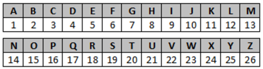

Gravity sort
======


Introdução
---------

Quando queremos encontrar algo, normalmente começamos a procurar nos arredeores e ir expandindo o raio de busca a partir do primeiro local em que a busca foi iniciada. Um perfeito exemplo disso é quando queremos encontrar nosso celular: começamos a buscar nos bolsos de nossas roupas e vamos expandindo a área de busca, procurando na bolsa ou na mochila, depois no cômodo em que estamos, em seguida em outros cômodos próximos a esse mesas e continuaremos a procurar nos cômodos mais distantes até encontrar (teoricamente, nunca perderíamos nada).

Mas e se você tivesse um móvel onde todos que entram na sua cada podem deixem seus celuares (de preferência algum com uma tomada por perto ou quem sabe uma base de carregamento), não seria mais simples de procurar e consumiria menos tempo até encontrar o seu celular?

Agora imagine que você queira ligar pra alguém através do seu celular e, que já aderiu a ideia do parágrafo anterior, logo tudo o que precisa fazer é ir até o móvel e pegar seu celular. Ao tê-lo em mãos, você o desbloqueia e acessa sua agenda de contatos, mas percebe que seus contatos não estão em ordem forçando você a olhar um por um até encontrar o contato desejado.

Fica claro que organização, e principalmente ordenação, são de vital importância para as atividades mais rotineiras e simples que executamos. Entretanto em um mundo onde sistemas e serviços digitais são cada vez mais frequentes, a ordenação vai muito além de encontrar um contato rápido. Onde gigantescos bancos de dados armazenam desde endereços até dados de pacientes hospitalizados, ordenar adequeada e eficientemente eses diversos tipos de dados significamuito mais do que economizar tempo, também significa evitar o trânsito desviando de uma via congestionada e evitar óbitos garantindo que um paciente em estado grave chegue a tempo no hospital para ser tratado.

E embora cruciais e indispensáveis, aqueles que mantém essa gigantesca infraestrutura digital que permeia praticamente todas as nossas atividades, os algoritmos de ordenação, são, por vezes, considerávelmente simples.

Introdução
---------

Pensando novamente na lista telefônica, considere o seguinte: você possui 7 contatos na sua agenda (sim, você é bem seletivo com relação ao salvar o número de outras pessoas) e que cada um deles começam com uma letra diferente. A conclusão mais óbvia seria "*pensar na ordem alfabética e colocá-los em ordem*", certo? Mas e se, ao invés de letras, pensarmos em letras que tal em números? 

??? Pergunta

Considerando que os contatos mencionados a lista de contatos abaixo, qual seria o *array* numérico correspondente?

`[Peach, Yoshi, Mario, Daisy, Toad, Luigi, Wario]`

::: Gabarito

Provavelmente você utilizou a posição das iniciais no alfabeto para realizar a conversão, certo?



Dessa forma a conversão da lista de contatos para um *array* numérico pode ser feita de seguinte forma:

| Contatos | Inicial do Nome | Número |
| -------- | --------------- | ------ |
| Peach    | P (16ª letra)   | 16     |
| Yoshi    | Y (25ª letra)   | 25     |
| Mario    | M (13ª letra)   | 13     |
| Daisy    | D (4ª letra)    | 4      |
| Toad     | T (20ª letra)   | 20     |
| Luigi    | L (12ª letra)   | 12     |
| Wario    | W (23ª letra)   | 23     |

Logo, a lista de contatos se torna o seguinte *array* numérico: `[16, 25, 13, 4, 20, 12, 23]`.

:::

???

Um Novo Ponto de Vista
---------

Ao invés de pensar no *array* de contatos simplesmente como uma lista de valores, considere uma representação visual do mesmo. Uma forma consideravelmente simples seria transformá-lo em um gráfico de barras onde cada valor é representado pela altura de cada uma das barras.

??? Exercício 1

Considerando o *array* de valores obtido anteriormente como  o gráfico abaixo, responda:


Em termos visuais, de que forma poderíamos ordenar os valores do *array* numérico?

::: Gabarito
Poderíamos ordenar os valores mudando as barras de posição, asté se obtivesse a seguinte representação:


:::

???

Se pararmos para pensar, **todos** os algoritmos estudados até agora realizam esse tipo de operação. De uma forma ou de outra, as barras são trocadas de lugar umas com as outras até se obter uma sequência ordenada.


??? Exercício 2

Considerando o *array* de valores obtido anteriormente como  o gráfico abaixo, responda:


Em termos visuais, de que forma poderíamos ordenar os valores do *array* numérico?

::: Gabarito

Poderíamos ordenar os valores mudando os fragmentos de posição, asté se obtivesse a seguinte representação:


:::

???

Se pararmos para pensar, **nenhum** dos algoritmos estudados até agora realizam esse tipo de operação. Definitivamente não é a forma mais intuitiva de se abordar um problema de ordenação, mas não se pode negar sua efetividade já que o *array* resultante está correto.

??? Checkpoint

Considernado a segunda forma de ordenação, qual a relação entre a quantidade de fragmentos de uma mesma cor, antes e depois da ordenação ter sido realizada? É necessário mudar todos os fragmentos de lugar?

::: Gabarito
A quantidade de fragmentos de uma mesma cor se preserva ao longo da operação. Além disso, nem todos os fragmentos precisam ser movidos (basta reparar nas 3 primeiras cores de fragmentos ou ainda a última barra na qual o único fragmento modificado é o do topo).
:::

???

Portanto, fica claro que, uma forma possível, ainda que menos usual, de se organizar um *array* numérico é tornando cada valor como uma pilha de fragmentos. Entretanto para que esse método funcione é necessário que cada um dos fragmentos de qualquer uma das pilhas possuam a mesma "altura", ou seja, que a divisão da barra em pilhas seja tal que não sobre fragmentos de tamanhos diferentes na mesma linha.

Isso significa que necessitamos do MDC (múltiplo divisor comum) dos valores encontrados nessa lista, obtendo os múltiplos de cada um dos valores e posteriormente obter o MDC deles. Entretanto cada novo valor inserido nessa lista potencialmente poderia alterar o MDC atual o que faria com que um algoritmo espec;ifico acessasse todos os valores até calcular o novo MDC, fazendo com que haja um consumo de tempo e recursos desnecessário.

Felizmente, exite um MDC global, ou seja, um número que é diivsor de todos os demais e, portanto, não só independe de quais e quantos números presentes no *array* como também dispensa refazer a busca por um novo MDC. 

??? Reflexão

Se ainda não veio nada à sua mente, basta pensar na definição básica de números primos, o que ela diz?  

::: Gabarito


:::

???

Logo, basta construir uma pilha de fragmentos de tamanho `1` para cada um dos valores da lista de contatos, o que se resume a criar um *array* do tamanho de cada valor da lista e preenchê-los com `1`.

!!! Aviso
Para facilitar a visualização dos *arrays* use a função fornecida abaixo:

````c
void display_array(int *input, int n) {
    printf("[ ");
    for(int i = 0; i < n; i++) {
        printf("%i", input[i]);
        if (i != n - 1) {
            printf(", ");
        }
    }
    printf(" ]");
}
````

!!!


??? Exercício

Crie uma função que receba um *array* de inteiros e, para cada um dos valores presentes neste, exiba no terminal um *array* preenchido com `1`.

::: Gabarito

````C
void unit_stack(int *input, int n) {
    int val;
    for(int i = 0; i < n; i++) {
        val = input[i];
        int stack[val];
        for (int j = 0; j < val; j++) {
            stack[j] = 1;
        }
        display_array(stack, val);
        printf("\n");
    }
}
````

:::

???

Nada impossível por enquanto, certo? Você provavelmente obteve o seguinte *output*:

````c
[ 1, 1, 1, 1, 1, 1, 1, 1, 1, 1, 1, 1, 1, 1, 1, 1 ]
[ 1, 1, 1, 1, 1, 1, 1, 1, 1, 1, 1, 1, 1, 1, 1, 1, 1, 1, 1, 1, 1, 1, 1, 1, 1 ]
[ 1, 1, 1, 1, 1, 1, 1, 1, 1, 1, 1, 1, 1 ]
[ 1, 1, 1, 1 ]
[ 1, 1, 1, 1, 1, 1, 1, 1, 1, 1, 1, 1, 1, 1, 1, 1, 1, 1, 1, 1 ]
[ 1, 1, 1, 1, 1, 1, 1, 1, 1, 1, 1, 1 ]
[ 1, 1, 1, 1, 1, 1, 1, 1, 1, 1, 1, 1, 1, 1, 1, 1, 1, 1, 1, 1, 1, 1, 1 ]
````

Mas parando pra pensar, é um pouco inconveniente ter que iniciar um *array* dentro de uma função pois ela se torna limitada ao escopo da mesma, impossibilitando realizar quaisquer outras operações posteriores. Seria muito mais interessante se esses vetores estivessem dentro de um outro o qual pudéssemos inicializar fora da função e apenas passá-lo como argumento. Ora, mas isso existe! Um vetor de vetores nada mais  é do que uma **matriz**!


Primeiramente, uma matriz possui tamanho definido. isso significa que devemos inicializá-la sabendo a quantidade de linhas e colunas necessárias. Claro que poderíamos fazer isso utilizando algum valor máximo definido globalmente (algo como `MAX_ROW` e `MAX_COL`), mas lembre-se que memória é um recurso valioso e limitado, então devemos usar somente o mínimo necessário.


Podemos novamente criar uma representação visual, desta vez do *output* obtido no exercício anterior. Ao invés de uma lista de `1` pense como sequências de ⚫ enfileiradas, como ilustra a imagem a abaixo


| `n`  | *output*                  |
| ---- | ------------------------- |
| 16   | ⚫⚫⚫⚫⚫⚫⚫⚫⚫⚫⚫⚫⚫⚫⚫⚫          |
| 25   | ⚫⚫⚫⚫⚫⚫⚫⚫⚫⚫⚫⚫⚫⚫⚫⚫⚫⚫⚫⚫⚫⚫⚫⚫⚫ |
| 13   | ⚫⚫⚫⚫⚫⚫⚫⚫⚫⚫⚫⚫⚫             |
| 4    | ⚫⚫⚫⚫                      |
| 20   | ⚫⚫⚫⚫⚫⚫⚫⚫⚫⚫⚫⚫⚫⚫⚫⚫⚫⚫⚫⚫      |
| 12   | ⚫⚫⚫⚫⚫⚫⚫⚫⚫⚫⚫⚫              |
| 23   | ⚫⚫⚫⚫⚫⚫⚫⚫⚫⚫⚫⚫⚫⚫⚫⚫⚫⚫⚫⚫⚫⚫⚫   |

Agora imagine a mesma disposição de ⚫ mas desta vez preenchendo uma grade quadriculada, onde cada bolinha ocupa um dos espaços da grade:

| `n`  | 1    | 2    | 3    | 4    | 5    | 6    | 7    | 8    | 9    | 10   | 11   | 12   | 13   | 14   | 15   | 16   | 17   | 18   | 19   | 20   | 21   | 22   | 23   | 24   | 25   |
| ---- | ---- | ---- | ---- | ---- | ---- | ---- | ---- | ---- | ---- | ---- | ---- | ---- | ---- | ---- | ---- | ---- | ---- | ---- | ---- | ---- | ---- | ---- | ---- | ---- | ---- |
| 16   | ⚫    | ⚫    | ⚫    | ⚫    | ⚫    | ⚫    | ⚫    | ⚫    | ⚫    | ⚫    | ⚫    | ⚫    | ⚫    | ⚫    | ⚫    | ⚫    |      |      |      |      |      |      |      |      |      |
| 25   | ⚫    | ⚫    | ⚫    | ⚫    | ⚫    | ⚫    | ⚫    | ⚫    | ⚫    | ⚫    | ⚫    | ⚫    | ⚫    | ⚫    | ⚫    | ⚫    | ⚫    | ⚫    | ⚫    | ⚫    | ⚫    | ⚫    | ⚫    | ⚫    | ⚫    |
| 13   | ⚫    | ⚫    | ⚫    | ⚫    | ⚫    | ⚫    | ⚫    | ⚫    | ⚫    | ⚫    | ⚫    | ⚫    | ⚫    |      |      |      |      |      |      |      |      |      |      |      |      |
| 4    | ⚫    | ⚫    | ⚫    | ⚫    |      |      |      |      |      |      |      |      |      |      |      |      |      |      |      |      |      |      |      |      |      |
| 20   | ⚫    | ⚫    | ⚫    | ⚫    | ⚫    | ⚫    | ⚫    | ⚫    | ⚫    | ⚫    | ⚫    | ⚫    | ⚫    | ⚫    | ⚫    | ⚫    | ⚫    | ⚫    | ⚫    | ⚫    |      |      |      |      |      |
| 12   | ⚫    | ⚫    | ⚫    | ⚫    | ⚫    | ⚫    | ⚫    | ⚫    | ⚫    | ⚫    | ⚫    | ⚫    |      |      |      |      |      |      |      |      |      |      |      |      |      |
| 23   | ⚫    | ⚫    | ⚫    | ⚫    | ⚫    | ⚫    | ⚫    | ⚫    | ⚫    | ⚫    | ⚫    | ⚫    | ⚫    | ⚫    | ⚫    | ⚫    | ⚫    | ⚫    | ⚫    | ⚫    | ⚫    | ⚫    | ⚫    |      |      |


Fica claro, portanto, que a quantidade de **linhas** `r` tem relação direta com a quantidade de valores do vetor de contatos, uma vez que cada linha. Já a quantidade de **colunas** `c` tem relação direta com o maior valor do vetor inicial. 

??? Exercício

implemente duas funções `matrix_r` e `matrix_c` que recebam um vetor de inteiros `v` e seu tamanho `n` e retornem os valores de `r` e `c`, respectivamente:

::: Gabarito

```c
int matrix_r(int *input, int n){
	int c = 0;
	for (int i = 0; i < n; i++) {
        c ++;
    }
	return n;
}
```

Note que em um contexto geral, a função `matrix_r` resume-se a uma função `len`.

```c
int matrix_c(int *input, int n) {
	int f = 0;
	for (int i = 0; i < n; i++) {
        if (input[i] > f) {
            f = input[i];
		}
    }
	return f;
}
```

Note que em um contexto geral, a função `matrix_c` resume-se a uma função `max`.

:::

???


Um Novo Ponto de Vista
---------

A tarefa anterior foi consider


u


Apos a apresentação, tem-se algumas conclusoes a respeito do Gravity sort:

1. **Alto desempenho** quando utilizado em algum hardware.
2. **Dificuldade** de implementacao computacional.

Tal dificuldade se da pois **deve-se criar uma maneira do computador realizar essa operacao** - que para nos, parece simples - de "queda das bolinhas".


Ábaco
---------

  Como se baseia em um ábaco, em um primeiro passo devemos compreender como traduzí-lo em termos de *software* e em um segundo momento implementá-lo para utilizar o *gravity sort* 


Portanto, a largura da estrutura define o comprimento **c** de cada fileira, ao passo que o comprimento da estrutura define a quantidade de fileiras **f** que podem ser adicionadas


Uma vez pronta a estrutura podemos adicionar as contas (representadas por ⚫) deixando ou não espaços entre elas (representados por ◯). Por simplicidade, será considerado que um espaço possui comprimento contante e igual ao de uma conta, já que, dessa forma, será  fácil compreender a distância entre duas contas


Logo, uma representação plausível de um ábaco seria a seguinte:


| c = 5   f = 4 |
| :------------ |
| ◯⚫◯◯◯         |
| ◯⚫◯⚫⚫         |
| ⚫◯◯◯◯         |
| ⚫◯⚫⚫◯         |
|               |

Pensando em agora em uma implementação de *software* podemos pensar em um ábaco como uma matriz $$M_{ij}$$ sendo i=c e j=f, onde as contas seriam representadas por um valor (por exemplo, `1`) enquanto os espaços seriam representados por outro valor(por exemplo, `0`).

Logo, o ábaco anteriormente citado poderia ser representado em termos de código da seguinte forma:

```c
int c = 15
int f = 5
int abaco[c][f] = { {0, 1, 0, 0, 0},
                    {0, 1, 0, 1, 1},
                    {1, 0, 0, 0, 0},
                    {1, 0, 1, 1, 0} };
```

  Portanto o primeiro objetivo consiste em obter os valores de **c** e **f** e "construir" o ábaco para, posteriormente, distribuir as contas.

  Obter o valor de **c** é uma tarefa razoávelmente simples, uma vez que este se resume em contar a quantidade de valores a serem distribuídos no ábaco. Um abordagem razóavel é contar quantos elementos estão disponíveis dentro do array inicial:

```c
int abacus_c(int *input, int n){
	int c = 0;
	for (int i = 0; i < n; i++) {
        c ++;
    }
	return n;
}
```

Como em C o tamanho de um array é passado para funções como parâmetro, a tarefa se torna ainda mais simples,  se tornando simplesmente:

```c
int abacus_c(int *input, int n) {
    return n;
}
```

Já o valor de **f** exige um pouco mais de trabalho, pois a quantidade de fileiras deve ser tal que não falte ao distribuir horizontalmente as contas. Uma abordagem razoável seria buscar pelo maior valor do array inicial, garantindo que não falte espaço para os demais valores:

```c
int abacus_f(int *input, int n) {
	int f = 0;
	for (int i = 0; i < n; i++) {
        if (input[i] > f) {
            f = input[i];
		}
    }
	return f;
}
```

??? Pergunta

Em um contexto mais geral, quais as funções básicas poderiam substituir as funções `abacus_c`  e `abacus_f`?

::: Gabarito

Respectivamente as funções `len` e `max`

:::

???

Com ambos os valores disponíveis podemos por fim, contruir o ábaco, inicializando uma matriz $$M_{cf}$$ com zeros:

```c
int c = abacus_c(input, n);
int f = abacus_f(input, n);
int abacus[c][f];
```


Distribuindo Contas
---------

Partindo agora para a segunda parte, devemos distribuir as contas referentes a cada um dos valores do array inicial, de tal forma que a quantidade de contas verticalmente empilhadas corresponda ao valor do a rray inicial. O cabeçalho da função que descreveria esse procedimento está descrita abaixo:

````c
void distribute_beads(int c, int f, int abacus[c][f], int *input) {

}
````

??? Pergunta

Por que na função `distribute_beads` o valor **n** referente ao tamanho do array `input` não é passado como parâmetro da função?

::: Gabarito

Por que **c** = **n**

:::

???

É razoável pensar que, para acessarmos os valores da matriz que representa o ábaco, precisaríamos de dois laços de repetição, um aninhado no outro. Para facilitar e melhor compreender a dinâmica envolvendo a distribuição de contas, vamos implementar cada um dos laços separadamente.

!!! Dica

Para facilitar a visualização da sua matriz conforme for realizando as atividades a seguir, utilize a função a abaixo:

```c
void show_matrix(int c, int f, int abacus[c][f]) {
    for (int i = 0; i < c; i++) {
        for (int j = 0; j < f; j++) {
            printf("%i", abacus[i][j]);
        }
        printf("\n");
    }
}
```

!!!

??? Atividade 1

Desenvolva a função `distribute_beads` de modo que ela acesse cada um dos valores do *array* `input` e exiba seus valores.

::: Gabarito

````c
	int val;
	for (int i = 0; i < c; i++) {
        val = input[i];
        printf("%i\n", val);
    }
````

:::

???

??? Atividade 2

Desenvolva a função `distribute_beads` de modo que ela acesse cada um dos valores do *array* `input` e exiba uma fileira de  ***** referente a cada valor.

::: Gabarito

````c
	int val;
	for (int i = 0; i < c; i++) {
        val = input[i];
        for (int j = 0; i < val; i++) {
            printf("*");
        }
        printf("\n");
    }
````

:::

???

??? Atividade 3

Desenvolva a função `distribute_beads` de modo que ela acesse cada um dos valores do *array* `input` e exiba uma fileira de  `1` referente a cada valor e preencha com `0` até atingir **f**.

::: Gabarito

````c
	int val;
	for (int i = 0; i < c; i++) {
        val = input[i];
        for (int j = 0; j < f; j++) {
            if( j < val) {
                printf("1");
            } else {
                printf("0");
            }
        }
        printf("\n");
    }
````

:::

???

??? Atividade 4

Desenvolva a função `distribute_beads` de modo que ela acesse cada um dos valores do *array* `input` e insira na matriz `abacus` uma fileira de  `1` referente a cada valor e preenchida com `0` até atingir **f**.

::: Gabarito

````c
	int val;
	for (int i = 0; i < c; i++) {
        val = input[i];
        for (int j = 0; j < f; j++) {
            if( j < val) {
                abacus[j][i] = 1;
            } else {
                abacus[j][i] = 0;
            }
        }
        printf("\n");
    }
````

:::

???

Nada muito difícil não é mesmo? Por fim, basta aplicarmos "gravidade" à matriz `abacus` para não só termos o *array* ordenado mas também utilizando apenas uma modificação, o que resulta em complexidade $$O(1)$$.

Mas... como implementamos "gravidade" mesmo?

Imaginando a matriz que representa um ábaco


??? Pergunta

Você conseguiria pensar em uma implementação na qual garantisse a complexidade teórica $$O(1)$$ ?

::: Gabarito
Este é um exemplo de gabarito, entre `md :::`.
:::

???

Sabemos que o primeiro loop é tal que acessa cada um dos valores do array inicial e cada um das colunas da matriz do ábaco, portanto sua implementação é 


```c
for (int i = 0; i < c; i++) {
    int val = input[i]
    for (int j = val; j > 0; j--) {
        abacus[j][i] = 1;
	}
    
}
```


```c
// Online C compiler to run C program online
#include <stdio.h>
#define MAX_SIZE 128

int abacus_c(int *input, int n){
	int c = 0;
	for (int i = 0; i < n; i++) {
        c ++;
    }
	return n;
}

int abacus_f(int *input, int n) {
	int f = 0;
	for (int i = 0; i < n; i++) {
        if (input[i] > f) {
            f = input[i];
		}
    }
	return f;
}

void distribute_beads(int c, int f, int abacus[c][f], int *input) {
	int val;
	for (int i = 0; i < c; i++) {
        val = input[i];
        for (int j = 0; j < f; j++) {
            if( j < val) {
                abacus[i][j] = 1;
            } else {
                abacus[i][j] = 0;
            }
        }
        printf("\n");
    }
}

void show_matrix(int a, int b, int matrix[a][a]) {
    for (int i = 0; i < a; i++) {
        for (int j = 0; j < b; j++) {
            printf("%i", matrix[a][b]);
        }
        printf("\n");
    }
}

void show_array(int n, int *array) {
    for (int i = 0; i < n; i++) {
        printf("%i ", array[n]);
    }
}

void gravity(int c, int f, int abacus[c][f]) {
    for (int j = 0; j < f; j++) {
        for (int i = 1; i < c; i++) {
            int val_previous = abacus[i-1][j];
            int val_current = abacus[i][j];
            if (val_previous == 1 && val_current == 0) {
                abacus[i-1][j] = 0;
                abacus[i][j] = 1;
                i = 0;
            }
        }
    }
}

void count(int c, int f, int abacus[c][f], int *output) {
    int val;
    for (int i = 1; i < c; i++) {
        for (int j = 0; j < f; j++) {
            if (abacus[i][j] == 1) {
                val++;
            }
            if (abacus[i][j] == 0) {
                break;
            }
        }
        
        printf("%i ", val);
        output[i] = val;
    }
}

int main() {
    int n = 7;
    int input[] = {1, 9, 32, 14, 43, 5, 24};
    int output[n];
    int c = abacus_c(input, n);
    int f = abacus_f(input, n);
    int abacus[f][c];
    
    distribute_beads(c, f, abacus, input);
    
    gravity(c, f, abacus);
    
    show_matrix(c, f, abacus);
    
    count(c, f, abacus, output);
    
    show_array(n, output);
    
    return 0;
}
```


Vamos considerar o array abaixo, que deve ser organizado de forma crescente. Note que a operacao de pegar o tamanho do array ja foi realizada.

```
x[] = {5, 3, 13, 7, 4, 11, 20, 17};

int len = sizeof(x)/sizeof(x[0]);
```

O array apresenta um total de 8 itens, o que correspondem as 8 "colunas" de um abaco. Sabemos tambem que cada coluna apresenta um numero de "bolinhas", que eh representada pelo numero inteiro correspondente. Logo, o array pode ser melhor visualizado da seguinte forma:


Para traduzir isso no mundo computacional, devemos avancar por partes. Primeiro, deve-se **criar a matriz que representa o abaco**, realizando a seguinte operacao:

```c
unsigned char *beads;
#define BEAD(i, j) beads[i * max + j]

for (i = 1, max = a[0]; i < len; i++)
    if (a[i] > max) max = a[i];
beads = calloc(1, max * len);
```

Definimos um array  que consta todos os itens - ou "bolinhas" - da matriz, sendo o [[for]] utilizado para checar o inteiro de maior valor do input - no caso do nosso array, 20.

Apos essa operacao, realizamos uma chamada de **calloc**, para alocar memoria no heap de acordo com o tamanho do array de "bolinhas", criando o espaco necessario para a matriz.

!!! Aviso
Tem algumas diferenças no uso de *malloc* e *calloc*. Pesquise a respeito.
!!!

```c
#include <stdio.h>
#include <stdlib.h>

void gravity_sort(int *a, int len){
    int i, j, max, sum;
    unsigned char *beads;
    #define BEAD(i, j) beads[i * max + j]

    for (i = 1, max = a[0]; i < len; i++)
        if (a[i] > max) max = a[i];
    beads = calloc(1, max * len);
    /* mark the beads */
    for (i = 0; i < len; i++)
        for (j = 0; j < a[i]; j++)
            BEAD(i, j) = 1;
    for (j = 0; j < max; j++) {
        /* count how many beads are on each post */
        for (sum = i = 0; i < len; i++) {
            sum += BEAD(i, j);
            BEAD(i, j) = 0;
        }
        /* mark bottom sum beads */
        for (i = len - sum; i < len; i++) BEAD(i, j) = 1;
    }
    for (i = 0; i < len; i++) {
        for (j = 0; j < max && BEAD(i, j); j++);
        a[i] = j;
    }
    free(beads);
}
int main()
{
    int i, x[] = {5, 3, 13, 7, 4, 11, 20, 17};
    int len = sizeof(x)/sizeof(x[0]);

    gravity_sort(x, len);
    
    for (i = 0; i < len; i++){
        printf("%d\n", x[i]);
    }
    return 0;
}
```


A partir desse monstro acima, podemos tirar algumas conclusoes a respeito do codigo necessario para a implementacao do gravity sort na linguagem C.


Você também pode criar


1. listas;
2. ordenadas,

assim como

* listas;
* não-ordenadas

e imagens. Lembre que todas as imagens devem estar em uma subpasta img.


Para tabelas, usa-se a [notação do
MultiMarkdown](https://fletcher.github.io/MultiMarkdown-6/syntax/tables.html),
que é muito flexível. Vale a pena abrir esse link para saber todas as
possibilidades.


| coluna a | coluna b |
| -------- | -------- |
| 1        | 2        |

Ao longo de um texto, você pode usar itálico, *negrito*, {red}(vermelho) e
[[tecla]]. Também pode usar uma equação LaTeX: $f(n) \leq g(n)$. Se for muito
grande, você pode isolá-la em um parágrafo.

$$\lim_{n \rightarrow \infty} \frac{f(n)}{g(n)} \leq 1$$

Para inserir uma animação, use `md ;` seguido do nome de uma pasta onde as
imagens estão. Essa pasta também deve estar em img.

;bubble

Você também pode inserir código, inclusive especificando a linguagem.


```py
def f():
print('hello world')
```

```c
void f() {
printf("hello world\n");
}
```

Se não especificar nenhuma, o código fica com colorização de terminal.

```
hello world
```

!!! Aviso
Este é um exemplo de aviso, entre `md !!!`.
!!!


??? Exercício

Este é um exemplo de exercício, entre `md ???`.

::: Gabarito
Este é um exemplo de gabarito, entre `md :::`.
:::

???